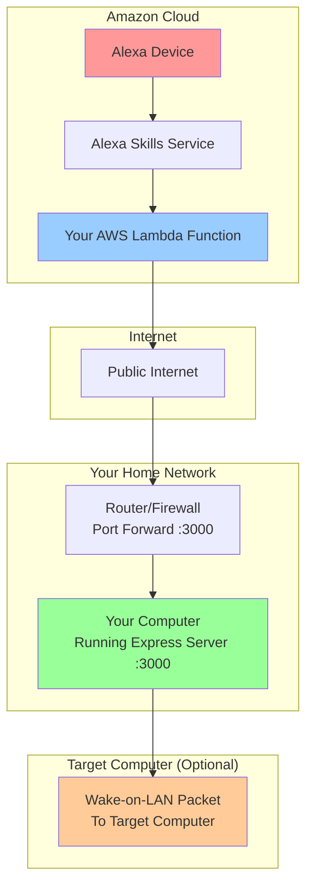
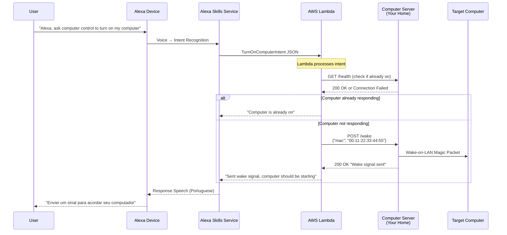
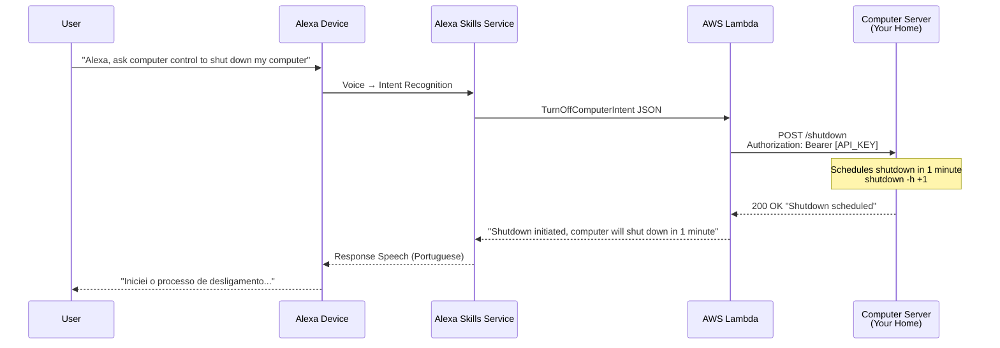
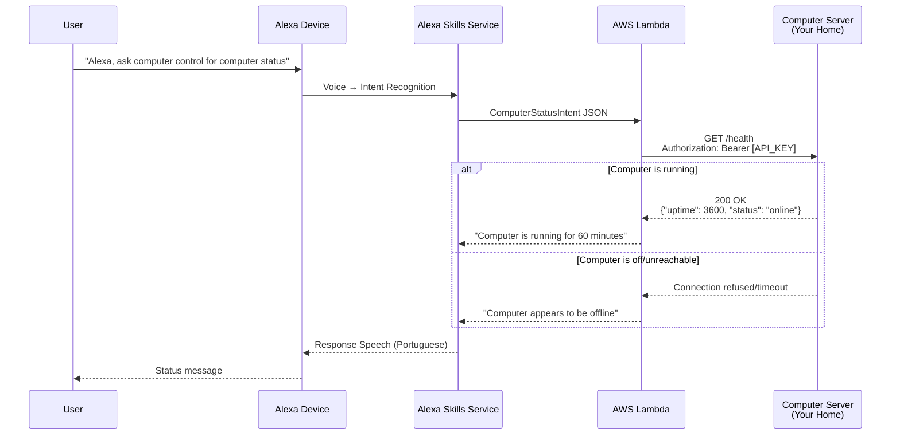
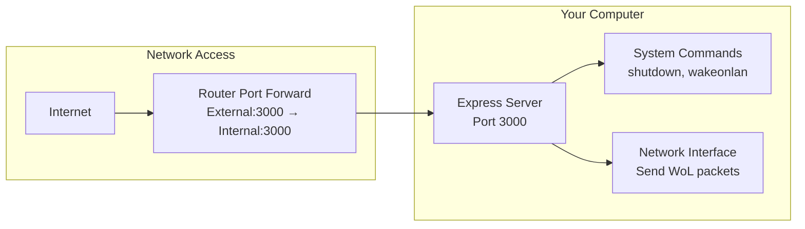
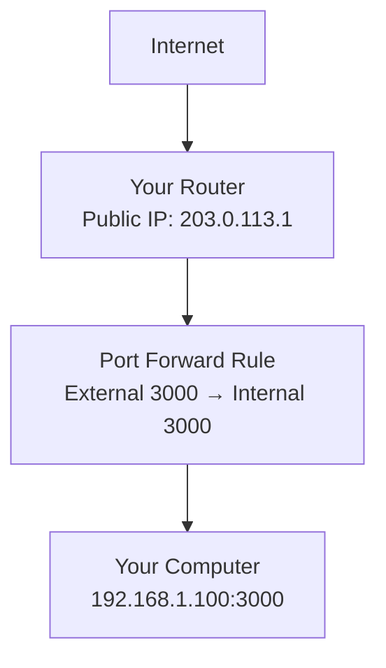
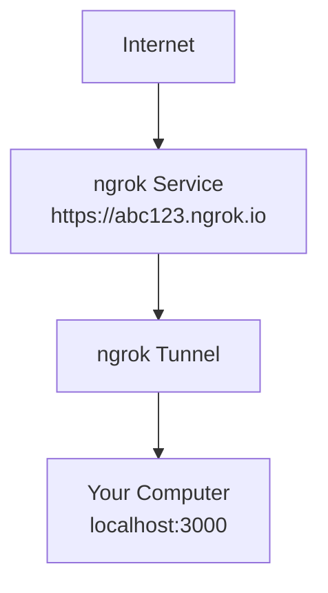
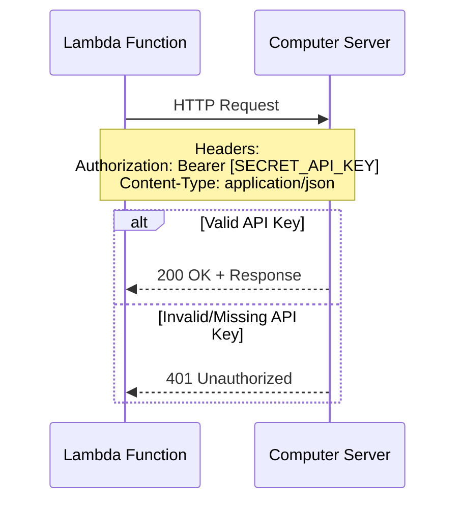
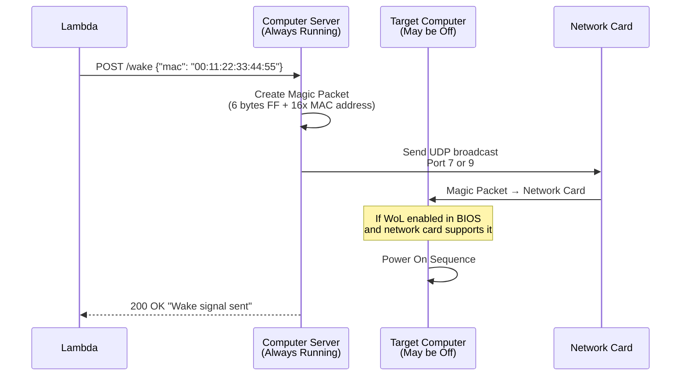
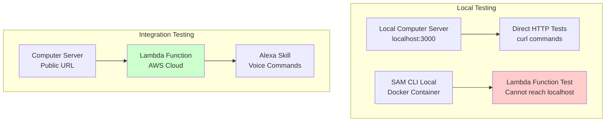

# Alexa Computer Control - Architecture & Workflow

## Overview

The Alexa Computer Control system allows you to remotely control your computer through voice commands via Amazon Alexa. The system consists of three main components that work together to bridge the gap between Alexa's cloud services and your local computer.

## System Components

### 1. **Local Computer Server** (`computer-server/`)
- **What it is**: A Node.js Express server that runs on your target computer
- **Purpose**: Receives commands and controls the local computer (shutdown, Wake-on-LAN, status)
- **Network**: Must be accessible from the internet (via port forwarding or ngrok)

### 2. **AWS Lambda Function** (`lambda-function/`)
- **What it is**: Cloud function that processes Alexa voice commands
- **Purpose**: Translates Alexa intents into HTTP API calls to your computer server
- **Network**: Runs in AWS cloud, makes outbound HTTP requests to your public server

### 3. **Alexa Skill** (`alexa-skill/`)
- **What it is**: Voice interface configuration for Amazon Alexa
- **Purpose**: Defines what voice commands trigger which intents
- **Network**: Managed by Amazon, sends requests to your Lambda function

## Network Architecture



## Request-Response Workflow

### Scenario 1: "Turn On Computer" Command



### Scenario 2: "Shut Down Computer" Command



### Scenario 3: "Check Computer Status" Command



## Network Setup Requirements

### 1. Computer Server Setup

Your computer needs to run the Express server that listens for commands:



**Required Steps:**
1. Install dependencies: `cd computer-server && npm install`
2. Configure `.env` file with API key and target MAC address
3. Start server: `npm start`
4. Configure router to forward port 3000 to your computer
5. **OR** use ngrok for temporary public access: `ngrok http 3000`

### 2. Internet Accessibility Options

#### Option A: Port Forwarding (Permanent)


**Setup:**
1. Access your router's admin panel
2. Create port forwarding rule: External 3000 → Internal 3000 → Your Computer IP
3. Use your public IP in Lambda environment: `http://YOUR_PUBLIC_IP:3000`

#### Option B: ngrok (Development/Temporary)


**Setup:**
1. Install ngrok: `brew install ngrok`
2. Run: `ngrok http 3000`
3. Use ngrok URL in Lambda environment: `https://abc123.ngrok.io`

## Security Considerations

### Authentication Flow



### Security Features
- **API Key Authentication**: All requests require Bearer token
- **CORS Protection**: Server configured for specific origins
- **Shutdown Safety**: 1-minute delay with cancellation option
- **Input Validation**: All endpoints validate request parameters
- **Request Logging**: All operations are logged for audit

## Environment Variables

### Lambda Function (`env.json`)
```json
{
  "ComputerControlFunction": {
    "COMPUTER_SERVER_URL": "http://your-public-ip:3000",
    "API_KEY": "your-32-char-secret-key-here",
    "COMPUTER_MAC": "00:11:22:33:44:55"
  }
}
```

### Computer Server (`.env`)
```bash
API_KEY=your-32-char-secret-key-here
COMPUTER_MAC=00:11:22:33:44:55
PORT=3000
```

## Wake-on-LAN Workflow



**Wake-on-LAN Requirements:**
1. Target computer BIOS must have WoL enabled
2. Network card must support WoL
3. Enable WoL on network interface: `sudo ethtool -s eth0 wol g`
4. Computer must be connected via Ethernet (WiFi WoL is unreliable)

## Testing Workflow



## Deployment Checklist

### 1. Local Setup
- [ ] Install computer server dependencies
- [ ] Configure `.env` with API key and MAC address
- [ ] Test server locally: `curl http://localhost:3000/health`
- [ ] Enable Wake-on-LAN on target computer

### 2. Network Setup
- [ ] Choose port forwarding or ngrok
- [ ] Test external access to server
- [ ] Document public URL for Lambda configuration

### 3. AWS Lambda Deployment
- [ ] Deploy Lambda function: `./deploy-lambda.sh`
- [ ] Configure environment variables in AWS Console
- [ ] Test Lambda with SAM CLI locally
- [ ] Test Lambda deployed in AWS

### 4. Alexa Skill Setup
- [ ] Create Alexa Skill in Developer Console
- [ ] Upload interaction model (Portuguese)
- [ ] Link skill to Lambda function ARN
- [ ] Test with Alexa simulator

### 5. End-to-End Testing
- [ ] Test voice commands with actual Alexa device
- [ ] Verify all intents (turn on, turn off, status, cancel)
- [ ] Test error scenarios (computer offline, network issues)

## Troubleshooting

### Common Issues

| Issue | Symptoms | Solution |
|-------|----------|----------|
| Lambda can't reach server | "Connection refused" errors | Check port forwarding/ngrok setup |
| Wake-on-LAN not working | Computer doesn't wake up | Enable WoL in BIOS and network interface |
| 401 Unauthorized | Authentication errors | Verify API_KEY matches in both systems |
| Alexa doesn't understand | Skill not responding | Check skill invocation name and intents |

### Debug Commands

```bash
# Test local server
curl http://localhost:3000/health

# Test public server access
curl http://YOUR_PUBLIC_IP:3000/health

# Test Lambda locally
./test-lambda-local.sh launch

# Test Wake-on-LAN manually
wakeonlan 00:11:22:33:44:55
```

This architecture enables secure, reliable remote computer control through natural voice commands while maintaining proper security boundaries and network isolation.